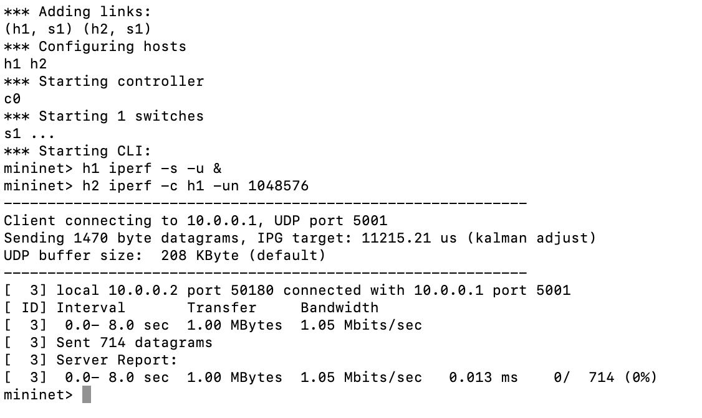

# SDN Traffic Classification using Logistic Regression

Классификация сетевого трафика в программно-определяемых сетях (SDN) с использованием модели машинного обучения Logistic Regression.

## Описание проекта

Цель проекта — автоматическое определение типа сетевого трафика (Ping, DNS, Telnet, Voice, ARP) в реальном времени на основе характеристик потока, собранных SDN-контроллером.

Это позволяет:

- оптимизировать использование сетевых ресурсов,
- повысить производительность сети,
- предотвращать перегрузки,
- не анализировать содержимое пакетов (актуально при использовании шифрования).

## Сравнение с DPI

В традиционных сетях для определения типа трафика часто применяется Deep Packet Inspection (DPI) — метод, анализирующий содержимое пакетов, включая заголовки и полезную нагрузку. Он позволяет:

- точно определять используемые протоколы (HTTP, FTP, DNS и др.),
- различать тип контента (видео, голос, текст),
- распознавать цели (стриминг, звонки, загрузки и т.п.).

Однако DPI имеет ряд ограничений:

- Неэффективен при шифровании — не может анализировать содержимое, если используется HTTPS, VPN и др.
- Требует больших ресурсов — так как нужно обрабатывать каждый пакет.
- Может вызывать вопросы конфиденциальности — заглядывает внутрь передаваемых данных.

Представленная мной система:

- не использует DPI, не анализирует полезную нагрузку,
- основана на flow-level статистике — агрегированных параметрах потока (байты, пакеты, скорость),
- работает в реальном времени и сохраняет высокую точность,
- подходит для анализа зашифрованного трафика, так как использует только метаданные.

## Архитектура системы


## Используемые технологии

- **Mininet** — генерация сетевого трафика в виртуальной SDN-среде.
- **SDN-контроллер (Ryu-manager)** — сбор информации о потоках.
- **Python (pandas, scikit-learn)** — обработка данных и обучение модели.
- **Jupyter Notebook** — для прототипирования и визуализации.
- **Dockerfile** - для работы со средой Mininet

## Этапы обработки данных

### 1. Сбор данных
- Сетевая среда моделируется в **Mininet**.
- **SDN-контроллер** фиксирует параметры потоков (MAC-адреса, количество пакетов, статус потока и пр.).
- Данные экспортируются в **CSV** и объединяются в датасет.

### 2. Предварительная обработка
- Удаление пропущенных значений.
- Исключение нерелевантных признаков (например, Forward Packets).
- Нормализация признаков.
- Разделение на обучающую и тестовую выборки (80/20).

### 3. Обучение модели
- Применяется **логистическая регрессия** (Logistic Regression).
- Модель обучается по признакам потока с разметкой типов трафика.
- Оценивается точность на тестовой выборке.

### 4. Оценка результатов
- Строится **матрица ошибок** (confusion matrix).
- Анализируются ошибочные классификации.

## Структура проекта

```
├── mininet/                           # Dockerfile для настройки и запуска среды Mininet
├── data/                              # CSV-файлы с данными потока
├── notebooks/                         # Jupyter ноутбуки для анализа и обучения
├── models/                            # Сохранённые обученные модели
├── results/                           # Графики, метрики и матрицы ошибок
├── README.md                          # Документация проекта
├── simple_monitor_AK.py               # Приложение Ryu-контроллера: мониторинг потоков и логирование статистики
└── traffic_classifier_python3.py      # Основной скрипт сбора данных и классификации
```

## Используемые признаки для определния типа трафика

| Название признака | Описание |
|-------------------|----------|
| `Forward Packets` | Общее количество пакетов в прямом направлении |
| `Forward Bytes` | Объём байтов в прямом направлении |
| `Delta Forward Packets` | Изменение количества пакетов в прямом направлении |
| `Delta Forward Bytes` | Изменение количества байтов в прямом направлении |
| `Forward Instantaneous Packets per Second` | Мгновенное значение PPS в прямом направлении |
| `Forward Average Packets per Second` | Среднее значение PPS в прямом направлении |
| `Forward Instantaneous Bytes per Second` | Мгновенное значение BPS в прямом направлении |
| `Forward Average Bytes per Second` | Среднее значение BPS в прямом направлении |
| `Reverse Packets` | Общее количество пакетов в обратном направлении |
| `Reverse Bytes` | Объём байтов в обратном направлении |
| `Delta Reverse Packets` | Изменение количества пакетов в обратном направлении |
| `Delta Reverse Bytes` | Изменение количества байтов в обратном направлении |
| `Reverse Instantaneous Packets per Second` | Мгновенное значение PPS в обратном направлении |
| `Reverse Average Packets per Second` | Среднее значение PPS в обратном направлении |
| `Reverse Instantaneous Bytes per Second` | Мгновенное значение BPS в обратном направлении |
| `Reverse Average Bytes per Second` | Среднее значение BPS в обратном направлении |

## Установка и запуск

### 1. Построение Docker-образа с Mininet
```bash
docker build -t mininet-custom .
```

### 2. Запуск контейнера Mininet с пробросом папки проекта
```bash
docker run --rm -it --privileged --net=host -v /Users/mikhailkatsuro/Downloads/diplom:/diplom mininet-custom
```

### 3. Запуск классификатора трафика внутри контейнера
```bash
sudo python3 /Diplom/traffic_classifier_python3.py supervised
```

### 4. Во втором терминале запуск контейнера Mininet
```bash
docker run --rm -it --privileged --net=host mininet-custom
```

### 5. Запуск топологии Mininet
```bash
sudo mn --topo single,2 --controller=remote,ip=127.0.0.1,port=6653 --nat
```

### 6. Генерация трафика между хостами
```bash
h2 ping -c 10 h1
h1 arping -c 5 h2 
h2 sipp -sn uas &
h1 sipp -sn uac h2 &
h2 sudo /usr/sbin/in.telnetd -debug
h2 sudo netstat -tuln | grep ':23'
h1 telnet h2
```

### 7. Тестирование пропускной способности сети
```bash
h1 iperf -s -u &
h2 iperf -c h1 -un 1048576
```

### Качество классификации
- Матрица ошибок показывает высокую точность классификации типов трафика:


### Анализ признаков
- PCA-анализ признаков для визуализации разделимости классов:


### Вывод в терминал при работе модели
- Таблица Потоков DNS:

- Таблица Потоков DNS, Voice, Ping:

- Таблица Потоков DNS, Telnet:


### Тестирование пропускной способности сети
- Без модели:

- С моделью:

